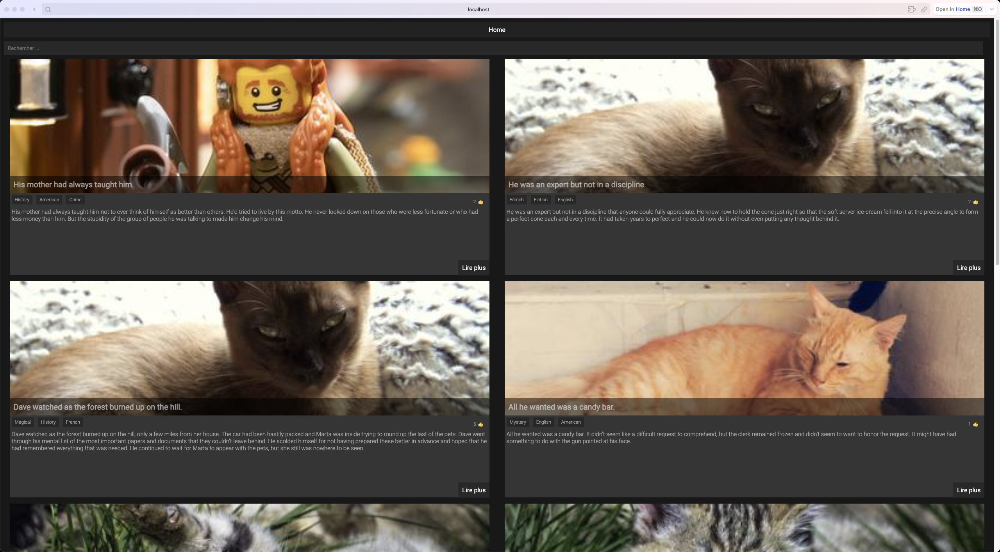
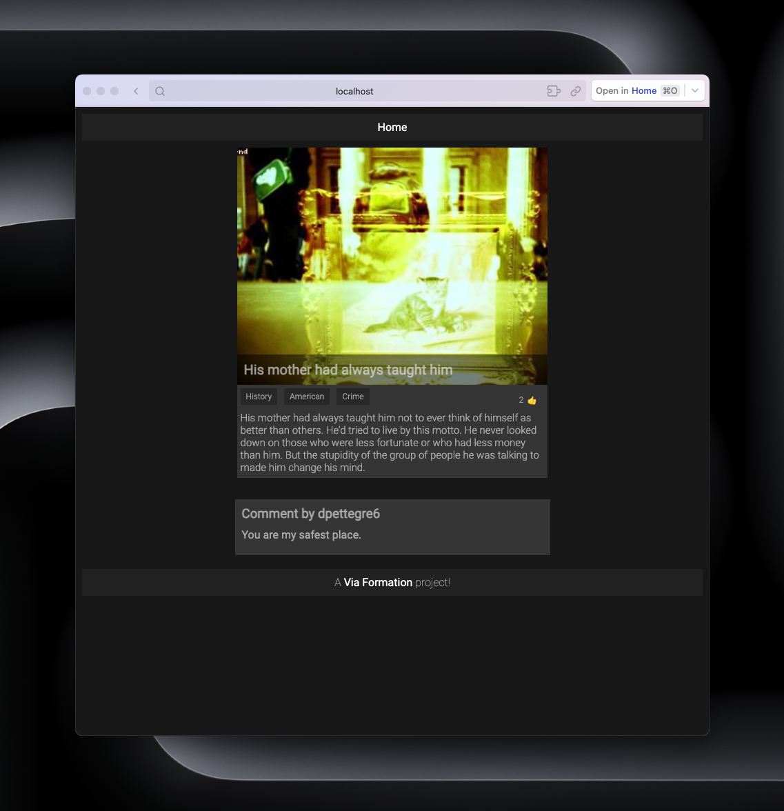

# Vue.js School Project

This project was developed as part of a school assignment to explore Vue.js, understand the concept of components, and practice making API calls using Axios.

<p align="center">
  
  
</p>

## Project Overview

The objective of this project was to build a web application that leverages the Vue.js framework. The main focus areas include:

- Implementation of Vue.js to create dynamic and reactive user interfaces.
- Understanding and utilization of Vue components for modular and reusable code.
- Integration of Axios to make asynchronous HTTP requests and interact with an external API.

## Features

- **Vue Components:** The project is structured using Vue components to encapsulate and manage different parts of the application.

- **API Integration:** Axios is employed to make API calls, fetching and displaying data in the application.

## Technologies Used

- Vue.js
- Axios

## API Integration

The project makes use of the External Blog API to fetch blog posts and comments. Ensure a stable internet connection for proper functionality.


## Getting Started

1. Clone this repository to your local machine.
   ```bash
   git clone https://github.com/Thomas-Martins/BlogAPI-VueJs-school-.git

## License

This project is licensed under the [MIT License](LICENSE) - see the LICENSE file for more details.
